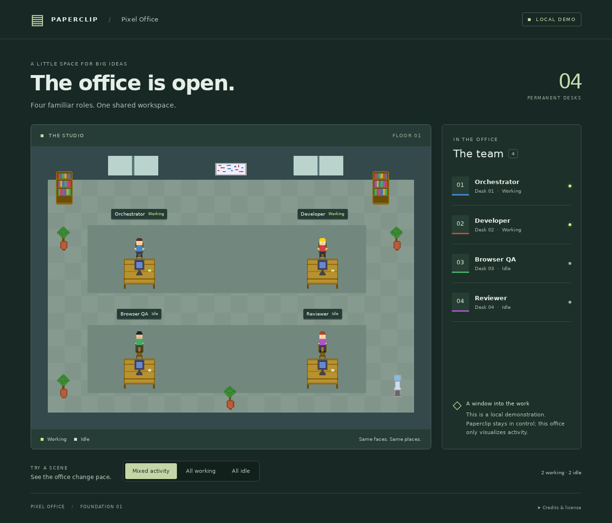
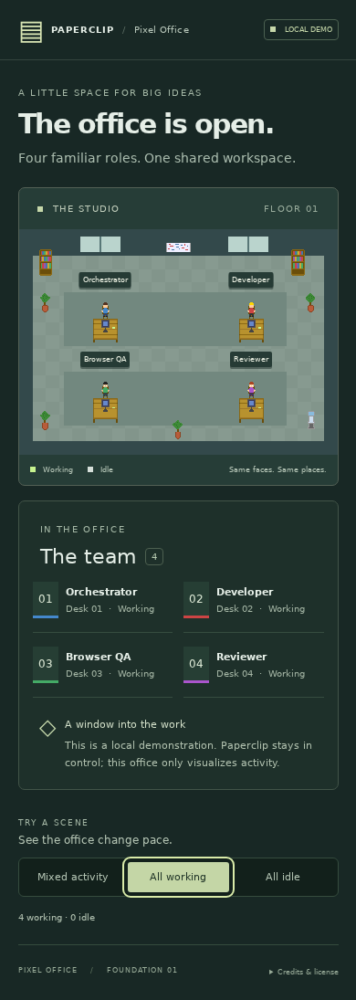

# Developer verification — DEV-28

Date: 2026-10-06. Implementation branch: `DEV-26-establish-the-initial-paperclip-pixel-office-foundation`. Repository: `Svend-Strandsbjerg/paperclip-pixel-office`. GitHub default branch confirmed with `gh repo view ... --json defaultBranchRef,url`: `main`.

## Workspace preflight

Paperclip `currentExecutionWorkspace` ID `420aecc0-9f28-49e4-abf6-81a84535ca60` identifies the expected repository, project workspace `e5e5b3e2-5220-41d4-89d5-2c795d72af23`, isolated_workspace mode, git_worktree strategy and assigned non-main branch. `git worktree list --porcelain` confirms the registered linked worktree. `baseRef` is `origin/main`; both `main` and `origin/main` resolve to baseline `bcf57a0121761a42d775064caf680d1f1e4159cc`. No branch/worktree was recreated or repointed.

## Initial verification (before runtime loopback correction)

| Command/check | Result |
| --- | --- |
| `npm install --save-dev vite typescript tsx @playwright/test @types/node` | Installed; package lock recorded; npm reported zero vulnerabilities. |
| `npm test` | PASS: 6 tests, 0 failures. Exact role identities/locations, state mapping, safe defaults, immutable registry, demos, sprite changes and reduced motion. |
| `npm run build` | PASS: TypeScript check and Vite production bundle. No runtime package dependencies. |
| `git diff --check` | PASS. |
| `npx playwright install chromium` | Chromium and headless shell downloaded; exited 0. Some optional FFmpeg download mirrors returned network policy 403 responses before the installer completed. |
| `npm run test:browser` | BLOCKED before browser assertions. Preview URL preflight receives HTTP 403 and reports the URL as already used, both on initial 4173 and final 4288. |
| `npm run preview -- --port 4288 --strictPort` | Vite starts successfully and reports `http://127.0.0.1:4288/`. |
| `curl -i http://127.0.0.1:4288/` while preview runs | HTTP 403; JSON error code `network_target_denied`, message `Network target denied by Paperclip sandbox policy.` |
| Local bind diagnostic on 4288 before starting Vite | Bind succeeded: this was not a real port collision. |

## Resumed verification after runtime loopback correction

On 2026-10-06, resumed the same registered DEV-26 worktree at clean implementation head `a5a2cea5f62d37342c744f39080aec06d16cdaf3`. Confirmed origin URL, assigned non-main branch, project workspace ID and git_worktree strategy from the supplied workspace metadata and local Git. GitHub default branch and PR #1 base remain `main`. No implementation, branch, worktree or PR was recreated.

| Command/check | Result |
| --- | --- |
| `npm run preview -- --port 4288 --strictPort` | PASS: existing production preview starts. |
| `curl -i --max-time 10 http://127.0.0.1:4288/` | PASS: HTTP 200 with application HTML. Preview stopped before the suite starts its own server. |
| `npm test` | PASS: all 6 tests. |
| `npm run build` | PASS: TypeScript and Vite; 17 modules transformed. |
| `npx playwright install chromium` | PASS: installed Chromium 1243 and headless shell into this run's fresh cache. Installer automatically used an available FFmpeg mirror after two policy-denied mirrors. No network policy or proxy settings changed. |
| `npm run test:browser` | PASS: both Chromium tests, 3.6 seconds. Initial attempt lacked the browser executable; rerun after installation passed. |
| Desktop browser assertions | Exactly four named roles and roster entries; mixed, all-idle and all-working states; canvas changes between idle/working; placement stable through state changes and reload; reload restores mixed fixture; no console/page errors or external requests. |
| Mobile browser assertions | 390px viewport; all labels inside scene; no horizontal overflow; keyboard activation; reduced-motion canvas remains stable while working state remains visible. |
| Screenshot inspection | Desktop and mobile screenshots visually inspected: four distinct characters/desks and readable role labels, roster and demo controls. See images below. |
| `git diff main...HEAD --check` | PASS. |

The previous preview-network blocker is resolved. Runtime coverage is Chromium desktop and mobile emulation, not other browser engines or physical devices. Live Paperclip integration remains intentionally out of scope. No downstream QA/reviewer tasks were created and no merge was performed. Exact final PR head is recorded in the PR/issue handoff because a commit cannot self-reference its own hash.

The Paperclip control-plane API at the supplied `http://127.0.0.1:3100` refused connections in this run. This does not affect the successful application preview/browser checks; final status recording is attempted separately, with adapter/runtime fallback if unavailable.
